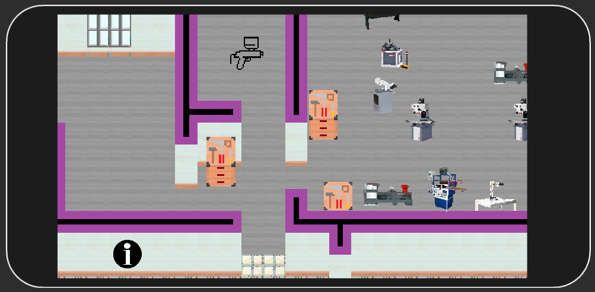

# Warsztat-WFP
Aplikacja mobilna pomagająca korzystanie z narzędzi na warsztacie
napisana z myślą o studentach Wydziału Form Przemysłowych na Akademii Sztuk Pięknych w Krakowie.

Program został napisany na silniku Unity i jest przeznaczony na urządzenia mobilne z Androidem lub iOS.

Aplikacja jest stylizowana graficznie na starsze gry typu RPG. Posiada mapę warsztatu z aktywnymi polami urządzeń, pomieszczeń i pomocą warsztatu.

### Dostępne funkcjonalności
* Dotykowe skalowanie i przesuwanie mapy warsztatu
* Responsywne okno dostosowane do pionowego i poziomego korzystania z aplikacji
* Aktywowanie ikony narzędzia wyświetla jego przeznaczenie, stopień niebezpieczeństwa oraz narzędzia kompatybilne
* Aktywacja ikony pomieszczenia informuje o przeznaczeniu tegoż pomieszczenia
* Aktywacja skrzynki wyświetla dostępne w niej przedmioty, po dotknięciu można wejść do wybranego narzędzia
* Aktywacja persony wyświetla zakres pomocy, którą może wykonać dany pracownik warsztatu
* Aktywacja znaku ! na mapie, umożliwia wyszukanie potrzebnego narzędzi po pracownika

Przybliżenie mapy

Przykładowe urządzenie

Przykładowe szafa z urządzeniami

